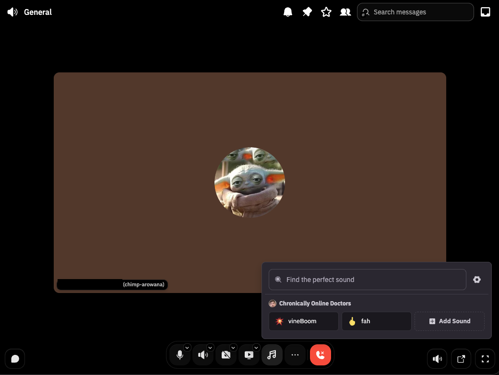
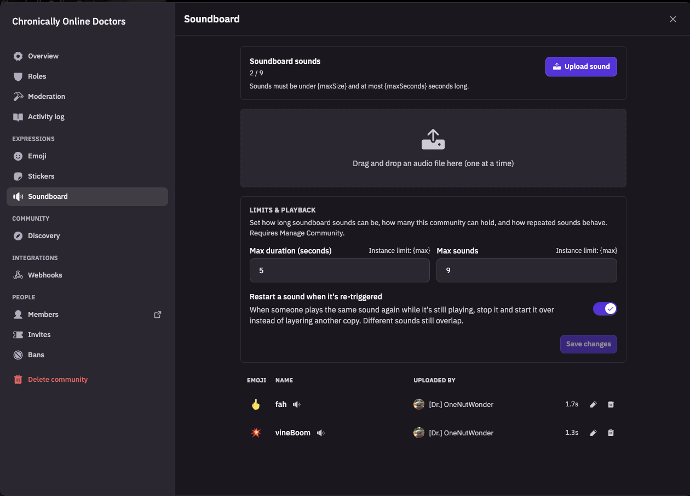

# Fluxer + Soundboard + Polls (fork)


This is a fork of [fluxerapp/fluxer](https://github.com/fluxerapp/fluxer) that
adds a **community soundboard** — members upload short clips, and anyone in a
voice channel can trigger them so everyone in the channel hears it — and
**Discord-style polls** in messages. Upstream declined to merge the soundboard,
so both live here as a maintained patch on top of upstream `main`.

- Branch: **`main`** — upstream `main` plus the soundboard commits on top
- Images: `ghcr.io/theotherguy2175/fluxer-{api,gateway,media-proxy,app-proxy-self-hosted}`
- Everything else in a Fluxer deployment is unchanged and keeps using upstream's images
- Upstream's own README continues below this section

<p align="center">
  
</p>
<p align="center">
  
</p>

## What you get

- **Community settings → Soundboard** tab: upload (`mp3` / `ogg` / `m4a` / `wav`,
  ≤ 5 MB, 0.1–5 s by default), rename, pick an emoji, set per-sound volume, delete
- **Soundboard button in the voice bar**: plays the clip for everyone in the
  channel (each client plays it locally in sync — nothing is mixed into LiveKit,
  so it works with voice/video exactly as before)
- **Personal hotkeys**: hover a sound in the soundboard menu → keyboard icon →
  record a key or chord. Per user, per device, in-app only (fires while Fluxer
  is focused and you're in one of that community's voice channels); Fluxer's own
  shortcuts always win and the picker warns about conflicts
- **Volume, two ways**: each sound has a community-set level up to 200%, and
  every member has their own soundboard slider (0–200%) in the menu that scales
  all sounds without touching voice volume
- New permission **Use Soundboard** (bit 42) to play sounds, granted to
  `@everyone` on new communities by default. Uploading and editing your own
  sounds needs **Create Expressions**; editing or deleting anyone's needs
  **Manage Expressions**; the community-level soundboard settings need
  **Manage Community** — the same split as emojis and stickers
- Audit log entries for create / update / delete
- Instance limits: `max_soundboard_sounds_per_guild` (default 9, ceiling 200),
  `max_soundboard_sound_duration_ms` (default 5000, ceiling 30000) and
  `max_soundboard_plays_per_second` (default 25, ceiling 100), adjustable per
  plan/community like the other limits

### Polls

- **Create poll** from the ➕ menu in the message box: question, 2–10 answers with
  optional emoji, single- or multi-choice, "allow changing answers", and a duration
- Live vote counts, voter list per answer, your own votes highlighted; when the
  poll ends the message locks and a **Poll results** system message is posted
- New permission **Send Polls** (bit 49), granted to `@everyone` on new communities
  by default; ending someone else's poll early needs **Manage Messages**
- Instance limits `max_poll_answers`, `max_poll_question_length`,
  `max_poll_answer_length`, `max_poll_duration_hours`; each community can tighten
  them in **Community settings → Polls**
- Design notes and data model: [POLLS.md](./POLLS.md)

## Run it: existing Docker Compose install

If you installed Fluxer with upstream's `install.sh`, you already have the
compose stack. Three steps:

```sh
cd <your fluxer directory>          # the one holding docker-compose.yml and .env

# 1. add the overlay file next to docker-compose.yml
curl -fsSLO https://raw.githubusercontent.com/theotherguy2175/fluxer/main/deploy/soundboard/docker-compose.soundboard.yml

# 2. add it to the COMPOSE_FILE line in .env — append to the existing line
#    (the installer writes one, e.g. docker-compose.yml:docker-compose.proxy.yml),
#    or create the line if there isn't one. The soundboard file must come last.
grep -q '^COMPOSE_FILE=' .env \
  && sed -i.bak 's|^COMPOSE_FILE=.*|&:docker-compose.soundboard.yml|' .env \
  || echo 'COMPOSE_FILE=docker-compose.yml:docker-compose.soundboard.yml' >> .env
grep '^COMPOSE_FILE=' .env      # e.g. COMPOSE_FILE=docker-compose.yml:docker-compose.proxy.yml:docker-compose.soundboard.yml

# 3. pull and recreate the four affected services
docker compose pull
docker compose up -d
```

Tested end to end on a fresh `install.sh` instance (amd64 and arm64).

Then, **once**, grant *Use Soundboard* and *Send Polls* to `@everyone` on
communities that already existed (new communities get both automatically):

```sh
for f in backfill-use-soundboard-permission backfill-send-polls-permission; do
  curl -fsSL https://raw.githubusercontent.com/theotherguy2175/fluxer/main/fluxer_api/scripts/$f.sql \
    | docker compose exec -T postgres psql -U fluxer -d fluxer
done
docker compose restart api gateway     # drop cached role permissions
```

The scripts are idempotent. Skip them if you'd rather hand the permissions out
per role in each community's settings.

Two optional `.env` knobs, both default to a published build:

| variable | default | meaning |
|---|---|---|
| `SOUNDBOARD_REGISTRY` | `ghcr.io/theotherguy2175` | where the four images come from |
| `SOUNDBOARD_IMAGE_TAG` | `soundboard` | moving tag = latest build; pin to an `sb-YYYYMMDD-xxxxxxx` tag for reproducibility |

`FLUXER_IMAGE_TAG` keeps controlling the other seven images as usual.

**Compatibility:** each soundboard build is made from upstream `main` at the
commit in its tag, and the seven upstream images you run alongside it should be
from around the same date. Running `v1` (upstream's moving tag) for the rest is
what we do ourselves; if upstream ever changes an internal NATS contract,
rebuild from a fresh upstream merge (see below) rather than pinning the seven back.

## Run it: new install

Install upstream Fluxer first with their installer (see *Self-hosting* in the
upstream README below / [docs.fluxer.app](https://docs.fluxer.app)), confirm it
works, then follow the *existing install* steps above. The backfill isn't
needed for communities created after the overlay is in place.

## Run it: Kubernetes

There's no chart; the compose file translates to plain manifests one-for-one.
With kustomize, swap the four images and leave the rest:

```yaml
images:
  - name: ghcr.io/fluxerapp/fluxer-api
    newName: ghcr.io/theotherguy2175/fluxer-api
    newTag: sb-20260916-b7bd210
  - name: ghcr.io/fluxerapp/fluxer-gateway
    newName: ghcr.io/theotherguy2175/fluxer-gateway
    newTag: sb-20260916-b7bd210
  - name: ghcr.io/fluxerapp/fluxer-media-proxy
    newName: ghcr.io/theotherguy2175/fluxer-media-proxy
    newTag: sb-20260916-b7bd210
  - name: ghcr.io/fluxerapp/fluxer-app-proxy-self-hosted
    newName: ghcr.io/theotherguy2175/fluxer-app-proxy-self-hosted
    newTag: sb-20260916-b7bd210
```

Bump all four together; they're built from one commit. Run the same two backfill
SQL scripts against your Postgres (`kubectl exec -i deploy/postgres -- psql -U fluxer -d fluxer < …`)
and restart `api` + `gateway`.

Note that current upstream requires `FLUXER_ERLANG_COOKIE` in the gateway's
environment (any random string). Compose installs get it from `.env`; if your
manifests predate that, add it or the gateway exits at start with
`FLUXER_ERLANG_COOKIE is required.`

## Build the images yourself

The images are built from **upstream's unmodified Dockerfiles** — the fork
changes source, not packaging. Two ways:

**GitHub Actions** (`.github/workflows/soundboard-images.yaml`): runs on every
push to `main` and on *Run workflow*. Builds `linux/amd64` +
`linux/arm64` on native runners, merges a manifest per image, and pushes to
`ghcr.io/<repo owner>/…` with tags `sb-<YYYYMMDD>-<sha7>` and `soundboard`.
If you fork this fork, it works unchanged with no secrets — but GHCR packages
created by a workflow start **private**; make each of the four public once
under *Packages → package → Package settings → Change visibility*, or give your
cluster an `imagePullSecret`.

**Locally** (`tools/soundboard/build-images.sh`): same images, same args.

```sh
tools/soundboard/build-images.sh --push                                   # ghcr.io/theotherguy2175, amd64
tools/soundboard/build-images.sh --push --registry ghcr.io/you            # your registry
tools/soundboard/build-images.sh --push --platform linux/amd64,linux/arm64
tools/soundboard/build-images.sh --only api,app-proxy --push              # subset
tools/soundboard/build-images.sh                                          # no push, --load into local docker
```

`docker login` to the target registry first. Cross-building amd64 from an
Apple Silicon machine works via emulation but takes ~10 minutes each for
`api` and `app-proxy`.

## Keeping up with upstream

`main` here is upstream `main` plus the soundboard commits. Bring in upstream
changes with a merge (not a rebase — `main` is public, and rewriting it would
break everyone who cloned it):

```sh
git remote add upstream https://github.com/fluxerapp/fluxer.git   # once
git config rerere.enabled true                                     # once; replays past conflict resolutions
git fetch upstream
git checkout main
git merge upstream/main
# resolve conflicts if any, then:
pnpm install --frozen-lockfile
(cd fluxer_api && pnpm typecheck)
(cd fluxer_app && pnpm typecheck)
(cd fluxer_app && pnpm vitest run src/features/guild/utils/guild_tabs/audit_log)
git push origin main                                               # triggers the image build
```

Files the soundboard touches that upstream also edits regularly (so conflicts
tend to land here): `fluxer_api/src/api/middleware/ServiceSingletons.ts`,
`fluxer_api/src/api/types/HonoEnv.ts`, `fluxer_api/src/api/guild/controllers/index.ts`,
`packages/schema/src/primitives/AuditLogValidators.ts`, the audit-log presenter
map, and the entrance-sound service the soundboard reuses. Everything else the
feature adds is in new files under `*/soundboard/`.

To see the soundboard as a single patch against upstream at any time:
`git diff upstream/main...main -- . ':!README.md' ':!deploy/soundboard/docker-compose.soundboard.yml' ':!tools/soundboard' ':!.github/workflows/soundboard-images.yaml'`

## Layout of the change

| area | what |
|---|---|
| `packages/constants`, `packages/schema`, `packages/errors`, `packages/limits` | permission bit, limits, request/response schemas, audit-log action types |
| `fluxer_api/src/api/guild/soundboard/` | repository, service, play service, controllers |
| `fluxer_api/scripts/backfill-{use-soundboard,send-polls}-permission.sql` | one-time permission grants for existing communities |
| `fluxer_api/src/api/channel/services/poll/`, `fluxer_api/src/api/worker/tasks/ExpirePolls.ts` | poll service, response enrichment, expiry cron |
| `fluxer_app/src/features/messaging/components/CreatePollModal.tsx`, `fluxer_app/src/features/channel/components/MessagePoll.tsx`, `…/guild_tabs/GuildPollsTab.tsx` | poll composer, message card, community settings tab |
| `fluxer_gateway/src/utils/event_atoms.erl` | `SOUNDBOARD_SOUND_PLAY` / `SOUNDBOARD_SOUNDS_UPDATE` gateway events |
| `fluxer_media_proxy/src/server/` | serves `soundboard-sounds/…` from the CDN bucket |
| `fluxer_app/src/features/guild/…/GuildSoundboardTab.tsx`, `fluxer_app/src/features/voice/components/Soundboard*.tsx` | settings tab, voice-bar menu, upload modal |
| `deploy/soundboard/docker-compose.soundboard.yml` | compose overlay |
| `.github/workflows/soundboard-images.yaml`, `tools/soundboard/build-images.sh` | image builds |

Storage is additive (new `guild_soundboard_*` and `message_poll*` tables / KV
keys); there is no migration and nothing upstream reads changes shape, so
rolling back is switching the four images back to upstream's (existing polls
simply stop rendering until you roll forward again).

---

<p align="center">
  <picture>
    <source media="(prefers-color-scheme: dark)" srcset="./fluxer_static/marketing/branding/logo-white.svg">
    
  </picture>
</p>

<p align="center">
  <a href="https://fluxer.app/download">
    </a>
  <a href="https://docs.fluxer.app">
    </a>
  <a href="https://fluxer.app/donate">
    </a>
  <a href="./LICENSE">
    </a>
</p>

<p align="center">
  <a href="https://flathub.org/apps/app.fluxer.Fluxer">
    </a>
</p>

# Fluxer

Fluxer is a free and open source instant messaging and VoIP chat app built for friends, groups, and communities.

<p align="center">
  
</p>

## Download

| Windows | macOS | Linux | Android | iOS |
| --- | --- | --- | --- | --- |
| [Installer (x64)][win-setup-x64] | [Disk image][mac-dmg] | [Flathub][flathub] | [APK][android-apk] | [TestFlight][ios-testflight] |
| [Installer (ARM64)][win-setup-arm64] | | [deb (x64)][linux-deb-x64] | [Obtainium][obtainium] | |
| [Portable (x64)][win-portable-x64] | | [deb (ARM64)][linux-deb-arm64] | | |
| [Portable (ARM64)][win-portable-arm64] | | [rpm (x64)][linux-rpm-x64] | | |
| | | [rpm (ARM64)][linux-rpm-arm64] | | |
| | | [AppImage (x64)][linux-appimage-x64] | | |
| | | [AppImage (ARM64)][linux-appimage-arm64] | | |
| | | [tar.gz (x64)][linux-targz-x64] | | |
| | | [tar.gz (ARM64)][linux-targz-arm64] | | |

The macOS disk image runs on both Apple silicon and Intel. Windows and Linux need the build matching your processor.

On Linux, prefer a repository over a single file so Fluxer updates with the rest of your system.

## Linux package repositories

Every repository serves both channels. The package is `fluxer` for stable, `fluxer-canary` for canary.

### Flatpak

Stable is on [Flathub][flathub], the easiest route on most desktops:

```sh
flatpak install flathub app.fluxer.Fluxer
```

Flathub has stable only. For canary, or to use Fluxer's own repository, open [this reference file][flatpak-ref] and your software manager takes over. Some desktops also accept `flatpak+https://pkgs.fluxer.com/flatpak/fluxer.flatpakref` in the address bar.

From a terminal:

```sh
flatpak install https://pkgs.fluxer.com/flatpak/fluxer.flatpakref
```

### Debian and Ubuntu

```sh
sudo install -d -m 0755 /etc/apt/keyrings
sudo curl -fsSL -o /etc/apt/keyrings/fluxer-archive-keyring.gpg https://pkgs.fluxer.com/keys/fluxer-archive-keyring.gpg
sudo curl -fsSL -o /etc/apt/sources.list.d/fluxer.sources https://pkgs.fluxer.com/deb/fluxer.sources
sudo apt update && sudo apt install fluxer
```

### Fedora and RHEL

```sh
sudo curl -fsSL -o /etc/yum.repos.d/fluxer.repo https://pkgs.fluxer.com/rpm/fluxer.repo
sudo dnf install fluxer
```

RHEL, Rocky, Alma and CentOS Stream need `sudo dnf install epel-release` first, because their base repositories lack `libXScrnSaver`. Fedora does not.

### Arch Linux

The repository is signed, so pacman needs the key once:

```sh
sudo pacman-key --init
curl -fsSL -o /tmp/fluxer-archive-keyring.asc https://pkgs.fluxer.com/keys/fluxer-archive-keyring.asc
sudo pacman-key --add /tmp/fluxer-archive-keyring.asc
sudo pacman-key --lsign-key 09D01339EE128925F75E675C855C5BDE34D205D2
```

`--lsign-key` is what makes pacman trust it. Then add the repository:

```sh
sudo tee -a /etc/pacman.conf >/dev/null <<'REPO'

[fluxer]
SigLevel = Required TrustedOnly
Server = https://pkgs.fluxer.com/arch/$repo/os/$arch
REPO
sudo pacman -Syu fluxer
```

Write `$repo` and `$arch` literally. Both are pacman variables, not shell ones, hence the quoted heredoc.

Full setup notes, including canary, are in the [Linux repositories documentation][docs-linux].

## Other ways to run it

- [Open Fluxer in a browser](https://web.fluxer.app), no install needed.
- [Host your own instance][docs-selfhost] from this repository.

## Documentation

- [Documentation home][docs]
- [Downloads][docs-downloads]
- [Self-hosting][docs-selfhost]

## License

The source is licensed under the [AGPL-3.0-or-later](./LICENSE) license.

Fluxer branding, icons, default avatars, badge artwork, screenshots and marketing
imagery are copyright Fluxer, all rights reserved, as set out in
[fluxer_static/LICENSE](./fluxer_static/LICENSE). Third-party material keeps its own
terms, listed in
[fluxer_static/THIRD_PARTY_LICENSES.md](./fluxer_static/THIRD_PARTY_LICENSES.md).

Public availability of this repository does not grant trademark, brand, or
endorsement rights.

[win-setup-x64]: https://pkgs.fluxer.com/desktop/stable/win32/x64/latest/setup
[win-setup-arm64]: https://pkgs.fluxer.com/desktop/stable/win32/arm64/latest/setup
[win-portable-x64]: https://pkgs.fluxer.com/desktop/stable/win32/x64/latest/portable
[win-portable-arm64]: https://pkgs.fluxer.com/desktop/stable/win32/arm64/latest/portable
[mac-dmg]: https://pkgs.fluxer.com/desktop/stable/darwin/arm64/latest/dmg
[linux-deb-x64]: https://pkgs.fluxer.com/desktop/stable/linux/x64/latest/deb
[linux-deb-arm64]: https://pkgs.fluxer.com/desktop/stable/linux/arm64/latest/deb
[linux-rpm-x64]: https://pkgs.fluxer.com/desktop/stable/linux/x64/latest/rpm
[linux-rpm-arm64]: https://pkgs.fluxer.com/desktop/stable/linux/arm64/latest/rpm
[linux-appimage-x64]: https://pkgs.fluxer.com/desktop/stable/linux/x64/latest/appimage
[linux-appimage-arm64]: https://pkgs.fluxer.com/desktop/stable/linux/arm64/latest/appimage
[linux-targz-x64]: https://pkgs.fluxer.com/desktop/stable/linux/x64/latest/tar_gz
[linux-targz-arm64]: https://pkgs.fluxer.com/desktop/stable/linux/arm64/latest/tar_gz
[flatpak-ref]: https://pkgs.fluxer.com/flatpak/fluxer.flatpakref
[flathub]: https://flathub.org/apps/app.fluxer.Fluxer
[android-apk]: https://github.com/fluxerapp/flutter_client/releases
[obtainium]: https://obtainium.imranr.dev/
[ios-testflight]: https://testflight.apple.com/join/PKZR6pK9
[docs]: https://docs.fluxer.app
[docs-downloads]: https://docs.fluxer.app/downloads/overview/
[docs-linux]: https://docs.fluxer.app/downloads/linux-repositories/
[docs-selfhost]: https://docs.fluxer.app/operator/get-started/
